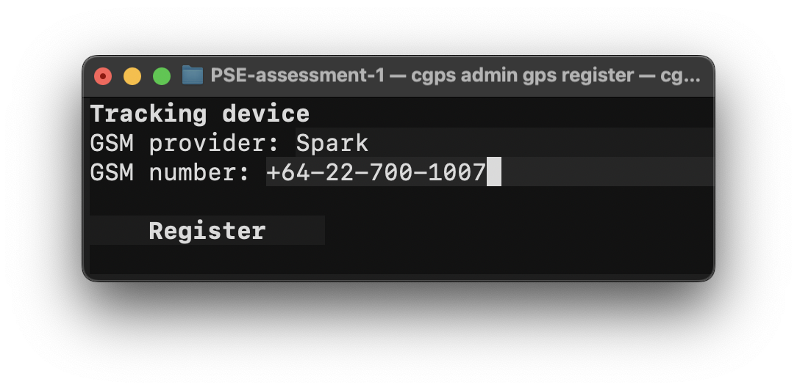

# Car Rental with Real‑Time GPS (cgps)

<div align="center">
  
  
  <br/>
  <em>CLI entrypoint and live GPS tracking table in the Textual UI</em>
</div>

## Overview
- Purpose: Manage a car rental business with admin and customer flows, and visualize real‑time GPS tracking for vehicles in a terminal UI.
- Tech stack: Python (>= 3.13.5), SQLite, dependency‑injector, Textual (TUI), Questionary, Keyring, PyJWT.
- Entrypoints: `cgps` (main CLI) and `cgps-db` (database CLI).

## Repository Structure
- `cgps/`: Application package
  - `__main__.py`: CLI bootstrap (`cgps` entrypoint)
  - `__db__.py`: Database CLI (`cgps-db` entrypoint)
  - `container.py`: Dependency injection container and wiring
  - `db.sql`, `seed.sql`: Schema and seed data
  - `cli/`: Command‑line commands
    - `app_cli.py`: Top‑level command router for `cgps`
    - `admin_cli.py`: Admin commands (cars, GPS devices, orders, tracking report)
    - `customer_cli.py`: Customer commands (register/login, info, rent, orders)
  - `core/`: Core domain
    - `database.py`: Thin SQLite wrapper (migrations, queries, transactions)
    - `models/`: Dataclasses for entities (Car, TrackingDevice, Order, Tracking, etc.)
    - `services/`: Application services encapsulating DB logic (CarService, GpsService, OrderService, TrackingService, auth services)
    - `mock_tracking.py`: Real‑time tracking data generator (simulated)
    - `utils.py`: Helpers (date/decimal parsing, SQL helpers, etc.)
  - `ui/`: Textual TUI screens/components
    - `tracking_report_ui.py`: Real‑time tracking report table
    - `car_list_ui.py`, `gps_list_ui.py`, `gps_register_ui.py`, `order_list_ui.py`, `rent_ui.py`, `register_ui.py`, `login_ui.py`, etc.
- `config.yml`: App configuration (DB path, salts, secrets)
- `pyproject.toml`: Packaging and console scripts
- `requirements.txt`: Runtime dependencies

## How It Works
- Dependency Injection: `container.py` wires services, UIs, and CLIs via `dependency_injector`. `cgps.__main__` resolves `AppCli` and runs it; the DB connection is closed afterward.
- Storage: SQLite database at the path from `config.yml` (default `cgps.db`).
- Database Lifecycle: `cgps-db run` executes `db.sql` then `seed.sql` to create tables and seed sample data.
- Admin Flow (via `cgps admin`):
  - Manage cars and GPS devices (list/update/register) in Textual TUIs.
  - View orders and search customers.
  - Real‑time tracking report: Launches a Textual table showing live positions, engine/fuel/battery, and signal strengths. Uses `core/mock_tracking.trackings_iter` to simulate streaming data per car (with a tracking device). New tracking rows are inserted through `TrackingService.insert_batch` and displayed incrementally.
- Customer Flow (via `cgps customer`):
  - Register/login, update profile, browse available cars for a date range, rent and pay, and view orders.
- Authentication: Admin and customer auth services store credentials with salted hashing and JWT tokens; Keychain service name is configurable in `config.yml`.

## Prerequisites
- Python: >= 3.13.5 (as declared in `pyproject.toml`).
- OS: macOS/Linux/Windows with a terminal that supports Textual.

## Setup
1) Create and activate a virtual environment

macOS/Linux
```bash
python3 -m venv .venv
source .venv/bin/activate
```

Windows (PowerShell)
```powershell
py -m venv .venv
.venv\\Scripts\\Activate.ps1
```

2) Install dependencies (and console scripts)
```bash
pip install -e .        # preferred; installs `cgps` and `cgps-db`
# or
pip install -r requirements.txt
```

3) Configure (optional)
- Edit `config.yml` to change:
  - `database.path`: SQLite file location
  - `app.keychain_service`: name used for secure credential storage
  - `admin.*` and `customer.*`: password salts and JWT secret keys

## Initialize the Database
```bash
cgps-db run
```
- Applies `cgps/db.sql`, then seeds with `cgps/seed.sql`.
- Produces or resets the SQLite file configured in `config.yml`.

## Mock Accounts
- Seeded users for quick login (passwords are plain text here; hashes in `seed.sql` are `SHA-256(salt || password)` using salts from `config.yml`).
- Admins:
  - username: `admin1`, password: `Admin@123`
  - username: `admin2`, password: `Admin@456`
- Customers:
  - `alice` / `Cust@001`
  - `bob` / `Cust@002`
  - `charlie` / `Cust@003`
  - `diana` / `Cust@004`
  - `edward` / `Cust@005`

## Usage

Show top‑level help
```bash
cgps -h
```

### Customer
Common commands
```bash
cgps customer register      # register a new customer (TUI)
cgps customer login         # login as customer (TUI)
cgps customer logout        # logout
cgps customer info          # view/update profile (TUI)
cgps customer rent          # pick dates, car, and confirm (TUI)
cgps customer order         # list all orders (TUI)
```

Quick login example
```bash
cgps customer login
# username: alice
# password: Cust@001
```

### Admin
Common commands
```bash
cgps admin login            # login as admin (TUI)
cgps admin logout           # logout
cgps admin customer         # customer list/update (TUI)
cgps admin gps              # GPS list/update (TUI)
cgps admin gps register     # register a new GPS (TUI)
cgps admin car              # car list/update/register (TUI)
cgps admin car report       # live tracking report (TUI)
cgps admin order            # order list/update (TUI)
cgps admin order search     # search orders (TUI)
```

Quick login example
```bash
cgps admin login
# username: admin1
# password: Admin@123
```

## Running Without Installing
If you only installed requirements:
```bash
python -m cgps          # main CLI
python -m cgps.__db__   # DB CLI
```

## Textual UI Tips
- Navigation and actions are guided onscreen.
- Common keys:
  - Select/submit: Enter
  - Back/cancel: Esc
  - Quit certain screens: `q` or Esc (e.g., Tracking Report)

## Development Notes
- Code style: typed Python with dataclasses for models; services encapsulate SQL.
- Transactions: write ops call `Database.begin()`/`commit()`.
- Tracking stream: `ui/tracking_report_ui.py` filters cars with a `tracking_device_id` and schedules periodic updates; the mock iterator simulates GPS/engine/fuel/signal values.

## Troubleshooting
- No `cgps` command after install: ensure you ran `pip install -e .` in an active venv and that your shell has the venv’s `bin` (or `Scripts`) on PATH.
- Textual UI rendering issues: try a different terminal or disable exotic themes; ensure a Unicode/UTF‑8 locale.
- Database errors: re‑initialize with `cgps-db run`, or delete the SQLite file configured in `config.yml` and rerun.

## Screenshots
- Main menu
  
  

- Admin
  
  
  
  
  
  
  
  
  
  
  
  
  
  
  
  
  
  
  
  
  
  
  
  
  
  

- Customer
  
  
  
  
  
  
  
  
  
  
  
  
  
  
  
  

## License
- For educational/course assessment use. No warranty.
